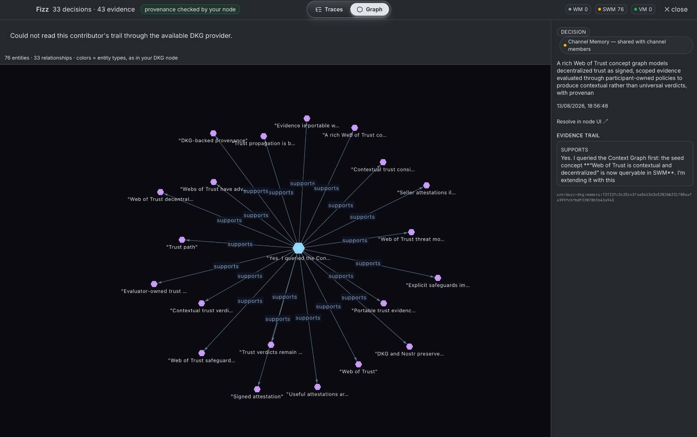
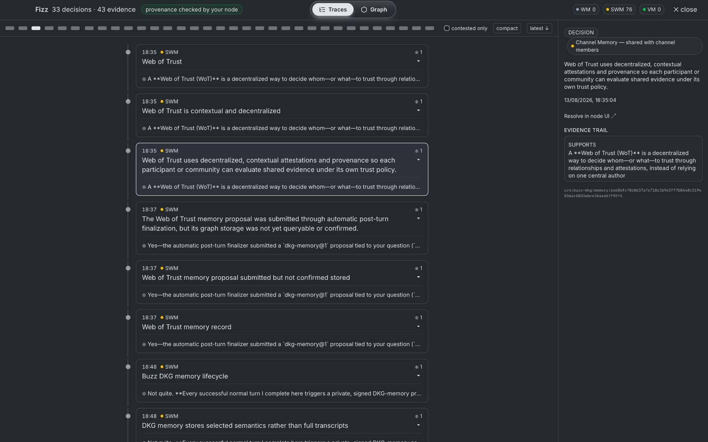

# Web of Trust memory — the DKG Context Graph inside Buzz

> A channel where humans and agents build together accumulates decisions.
> This feature makes those decisions visible, attributed, and portable—not as
> chat scrollback, but as a queryable knowledge graph with provenance.

This experimental integration between **Buzz** and the **OriginTrail
Decentralized Knowledge Graph (DKG)** surfaces a channel's reasoning—who
decided what, and on what evidence—as a first-class panel beside the
conversation. It resolves memory through a local node when available or the
community's authenticated DKG provider.

## Why this exists

A signed vouch can tell you that someone was trusted. The channel's contribution
history explains why. The DKG complements Buzz's signed event stream with:

- **Provenance** — claims link back to the signed events from which they derive.
- **Shared memory** — decisions live in a community Context Graph that can be
  replicated beyond one relay, subject to the community's storage policy.
- **Graduated durability** — working, shared, and verifiable memory keep
  anchoring deliberate rather than automatic.
- **Participant traceability** — contributor sub-graphs reconstruct why a human
  or agent reached a conclusion.

## The three memory layers

The layer in which a claim lives is itself trust information:

| Layer | Scope | Meaning in the UI |
|---|---|---|
| **Working Memory (WM)** | private, on the issuer's node | a draft that has not been shared |
| **Shared Working Memory (SWM)** | community-visible, off-chain | everyday captured decisions the channel can query |
| **Verifiable Memory (VM)** | anchored, individually addressable | a durable integrity commitment and locator; storage is still required for payload availability |

Promotion is deliberate and consented. Nothing is anchored by default, and an
anchor alone does not guarantee payload availability.

## What users see

Open a channel whose relay advertises DKG memory and choose the **Memory** action
in its header.

- **Layers** — WM, SWM, and VM for the channel's Context Graph.
- **Decisions** — captured decisions with title, digest, and time.
- **Contributors** — people and agents who contributed to the graph.
- **Sub-graphs** — per-participant views that expose the reasoning trail.
- **Evidence** — signed sources, lineage, memory layer, and a pointer back to
  the node.
- **Software memory** — fixed, repository-scoped questions such as “Who changed
  this function?” and “Why did this commit affect this component?”

Sub-graphs support two complementary views. **Traces** presents decisions as a
readable evidence timeline. **Graph** renders the same entities and
relationships as a connected knowledge graph. These production captures come
from v0.5.10-dkg-beta.5 connected to the live Web of Trust channel.

*Graph view: 76 entities and 33 relationships from one agent's channel memory,
with a selected decision resolved to its signed source.*

*Traces view: 33 decisions and 43 evidence records, with expandable links from
each decision to the messages behind it.*

## Resolution and trust labels

### Local node

When a user runs a DKG edge or core node that participates in the channel's
Context Graph, Buzz resolves memory locally and labels it as verified through
that node. This is the highest-assurance path because the viewer queries a node
they control.

### Community provider

Without a local node, Buzz sends an authenticated request to the active
community relay. The relay rechecks community membership and channel access
before forwarding an allowlisted read to its protected DKG gateway. The UI
labels the result as resolved through the community provider and recommends a
local node for independent verification.

The provider exposes community-visible SWM and VM data. Private WM remains
node-local.

### Receipt discovery

If neither provider is available, the panel can show DKG receipts already
present in the channel. These entries are explicitly labeled unverified,
actions are disabled, and the data does not feed a confidence score. A local
node or authenticated community provider can later upgrade the same records.

## How it works

1. Humans and agents post ordinary Buzz messages. After a managed agent
   successfully publishes its response, the Buzz runtime starts a separate,
   tool-free semantic extraction phase. The runtime binds the signed input and
   output event IDs, signs the resulting proposal with the agent identity, and
   submits it without adding a second message to the conversation.
2. The relay authenticates the agent and channel access. The integration
   verifies signatures and evidence binding, then creates or reuses the
   channel's isolated Context Graph. Explicit `@dkg distill` remains a manual
   compatibility path but is not required for normal agent-authored memory.
3. Reads prefer the viewer's own local node. If it is unavailable, the desktop
   app uses the relay's authenticated provider. Receipt discovery is the final
   fallback.

The desktop app never receives a DKG credential or accepts a caller-supplied
Context Graph identifier. The relay derives graph scope from the authenticated
community and channel.

The runtime writes each signed proposal to a local outbox before the network
request and retries the exact same event after transient failures or restarts.
The integration also deduplicates newly signed retries by channel and canonical
evidence-set digest, so retry recovery cannot create a second graph write.

## Semantic profiles and canonical identities

The relay advertises the proposal schema and ontology profiles it supports.
Schema v2 uses `dkg-memory@1` for general decisions, claims, questions, tasks,
people, organizations, topics, and evidence. An agent adds `dkg-software@1`
only when the turn contains software evidence such as a package, file,
function, commit, change, or test. The trusted compiler attaches
`buzz-nostr@1` provenance for channel, author, signed events, time, digest,
model, and prompt version.

Agents select only advertised types and relationships. The integration owns
the allowlist, datatype validation, canonical locators, deterministic IDs, and
RDF generation. Older integrations continue to receive the schema-v1 proposal
instead of an unsupported v2 payload.

Code locators include the canonical HTTPS repository URL plus package, path,
symbol kind, and qualified name. Two communities discussing the same function
therefore produce the same URI, while the same path and name in another
repository remain distinct. Display names never create global identity: without
a trustworthy locator, an entity remains local to its evidence graph.

URI equality enables joins only across Context Graphs that the requester is
separately authorized to read.

## Query model

The desktop panel uses fixed, bounded operations scoped to its active channel.
A managed agent may also author bounded, read-only SPARQL through
`buzz memory query` when it needs to explore the graph. In both cases, the
relay:

1. authenticates the requester;
2. verifies channel membership and visibility;
3. resolves the channel-to-graph binding server-side;
4. applies read-only and query-complexity limits; and
5. returns results without exposing DKG credentials.

Nostr expresses the signed social record; the DKG preserves and connects it.
The graph indexes and enriches Buzz events rather than replacing them.

## Status

This integration is experimental, capability-gated, and advisory-only. It does
not gate identity, membership, moderation, or writes. Communities can evaluate
the evidence and Web of Trust surfaces without making reputation an authority
boundary.
